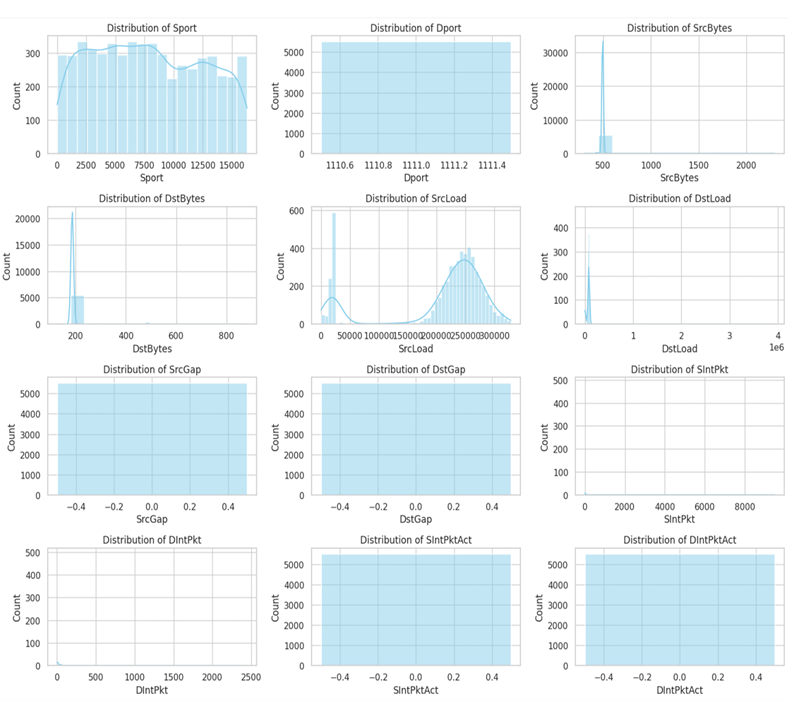
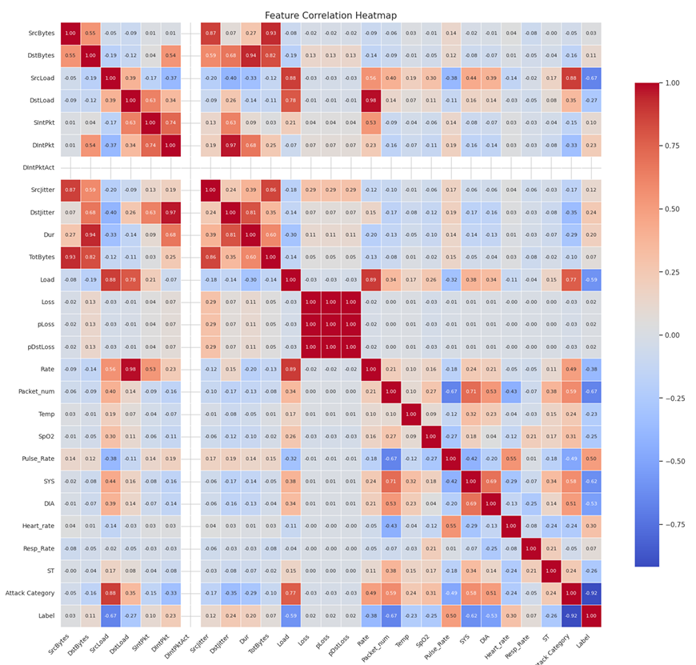
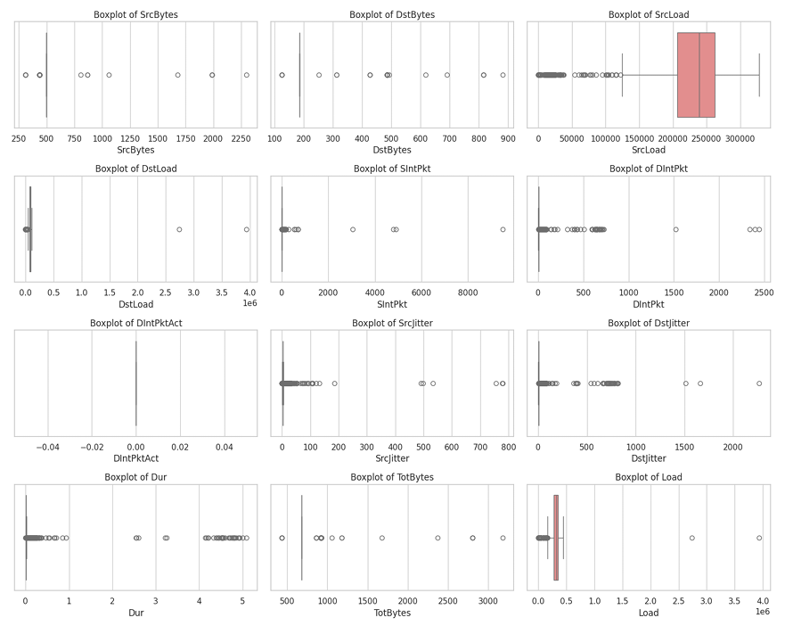
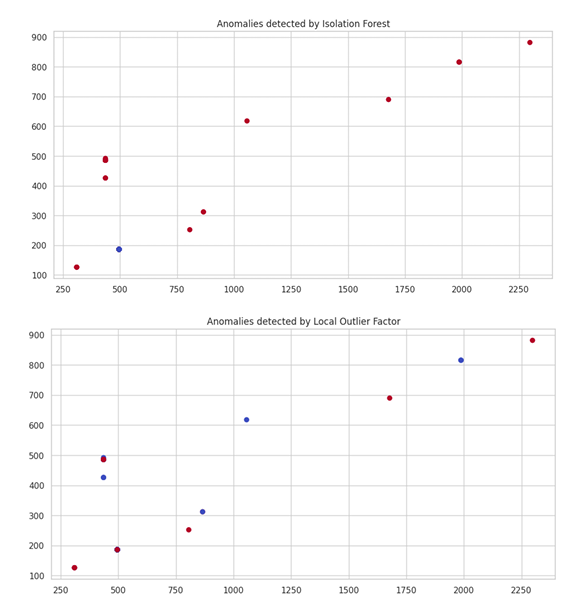

# AI & Workshop — Anomaly Detection and Classification

This repository presents an applied project from the **Artificial Intelligence and Workshop** course at **Amirkabir University of Technology (Tehran Polytechnic)**.  
The project focuses on **data preprocessing, anomaly detection**, and **binary classification** using Python and machine learning models from scikit-learn.

---

## 📘 Project Overview

The objective of this work is to design an **end-to-end data analysis pipeline** capable of identifying **anomalies** and classifying samples into normal and abnormal categories.  
The project integrates **exploratory data analysis (EDA)**, **outlier detection**, **class balancing**, and **supervised classification** to achieve reliable performance across multiple evaluation metrics.

---

## ⚙️ Methodology

### 1. Data Preprocessing
- Loaded and cleaned the dataset.  
- Removed irrelevant or low-variance attributes.  
- Applied **IQR filtering** to detect and remove extreme outliers.  
- Normalized and scaled continuous features for stable model convergence.  
- Balanced dataset using **SMOTE (Synthetic Minority Oversampling Technique)**.  

---

### 2. Exploratory Data Analysis (EDA)
Visual and statistical analysis was performed to understand data distributions, correlations, and outlier patterns.

#### 🔹 Feature Distributions
The following plots illustrate the distribution of key numerical features in the dataset.

#### 🔹 Feature Correlation Matrix
A strong correlation was observed among network traffic–related and load-based features.  
Highly correlated variables were identified to prevent redundancy in the learning phase.

#### 🔹 Outlier Analysis (Boxplots)
Boxplots were used to visualize the spread and detect outliers before IQR filtering.

---

### 3. Anomaly Detection
Two unsupervised algorithms were implemented and compared to identify potential outliers and abnormal samples.

| Algorithm | Description | Observation |
|------------|--------------|--------------|
| **Isolation Forest** | Detects anomalies by randomly isolating points through recursive partitioning. | Detected several high-deviation samples effectively. |
| **Local Outlier Factor (LOF)** | Evaluates local density deviation from neighboring points. | Captured subtle outliers not detected by IQR. |

---

### 4. Classification Models

After preprocessing and anomaly filtering, three supervised machine learning models were trained and optimized using `GridSearchCV`.

| Model | Accuracy | F1 (Class 1) | Precision (Class 1) | Recall (Class 1) | Key Parameters |
|:------|:----------|:-------------|:--------------------|:------------------|:----------------|
| **Nearest Centroid** | **82.8%** | **0.58** | **0.73** | **0.50** | `metric=manhattan`, `shrink_threshold=None` |
| **Bernoulli Naive Bayes** | 79.7% | 0.68 | — | — | Fast execution, used as a baseline |
| **Logistic Regression** | 78.3% | 0.66 | — | — | Interpretable model with moderate accuracy |

---

## 📊 Results and Analysis

### 🔹 Model Performance Summary

- **Nearest Centroid** achieved the best overall accuracy (**82.8%**) after hyperparameter tuning.  
- **BernoulliNB** provided very fast execution and stable results.  
- **Logistic Regression** performed adequately but required longer training time.  

### 🔹 Confusion Matrix (Nearest Centroid)
